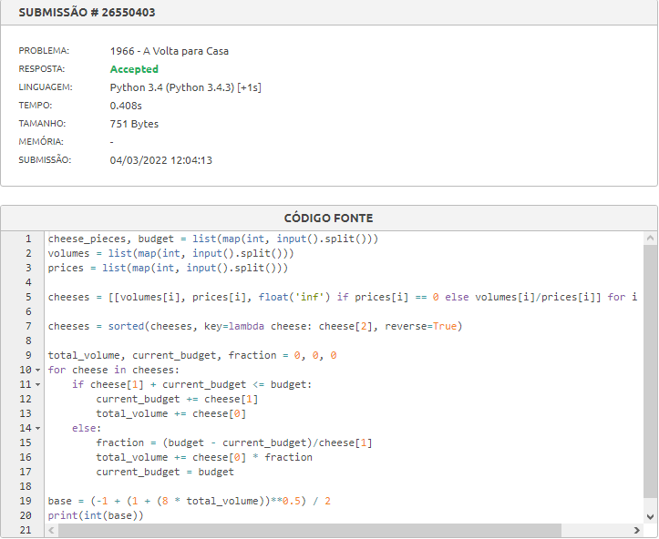
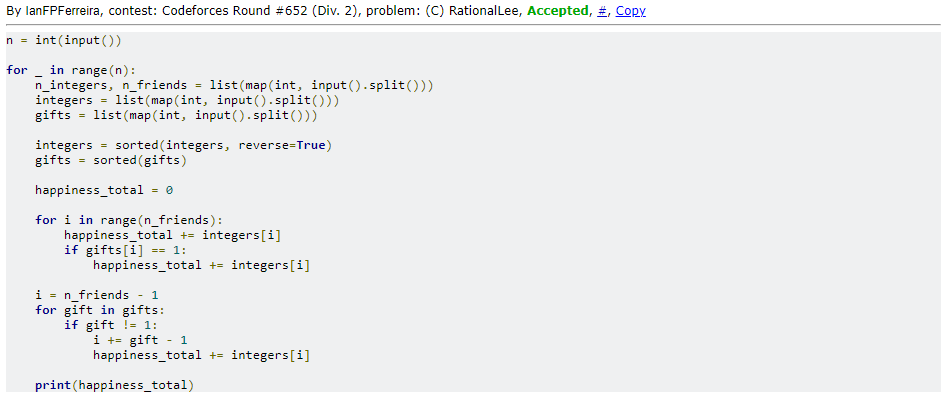
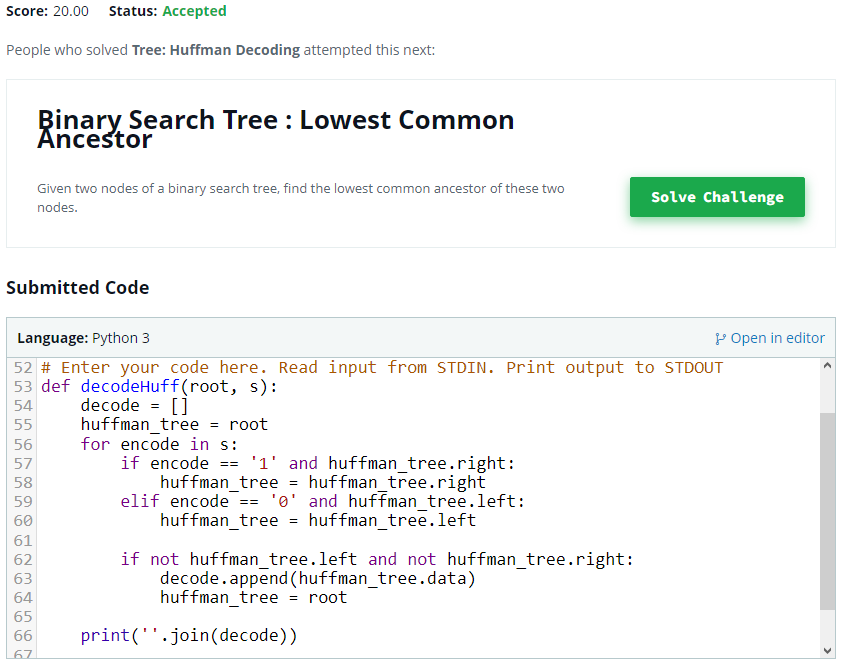
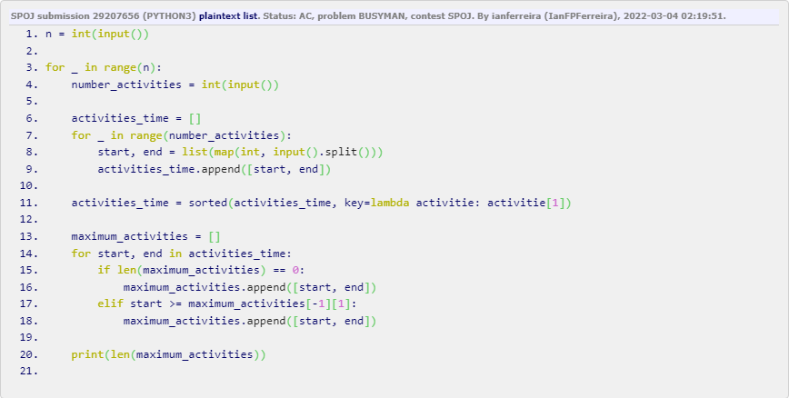

# Greedy_Dupla17

**Número da Lista**: 3<br>
**Conteúdo da Disciplina**: Algoritmos Ambiciosos<br>

## Alunos
|Matrícula | Aluno |
| -- | -- |
| 18/0096991  |  Álvaro Leles Guimarães |
| 18/0102087  |  Ian Fillipe Pontes Ferreira |

## Sobre 
<!-- Descreva os objetivos do seu projeto e como ele funciona. -->

Esse projeto tem como objetivo mostrar a utilização de algoritmos ambiciosos resolvendo problemas de programação competitiva. Para isso resolvemos 4 problemas pertencentes a 4 juízes onlines diferentes:

- HackerRank
- CodeForces
- SPOJ
- beecrowd

O funcionamento do projeto se dá com a execução de cada arquivo, passando como valores de entrada os exemplos de cada problema, que se encontra nos links que há dentro de cada arquivo.py neste repositório. 

## Screenshots

| | |
:---------: | :------: |
| Accepted do beecrowd | Accepted do Codeforces |
|  |  |
| Accepted do HackerRank | Accepted do SPOJ |
|  |  |


## Instalação 
**Linguagem**: Python<br>
**Pré-requisitos**: Para rodar o projeto é necessário ter o Python instalado na versão 3.8.5, que foi a versão utilizada, ou uma versão superior. Acesse <a href="https://www.python.org" target="_blank">aqui</a> para instalar o Python.

## Uso 

### **1. Clonar o repositório:**

```python
git clone https://github.com/projeto-de-algoritmos/Grafos2_TaxiTrajeto.git
```

### **2. Executar os códigos:**

Com o python instalado execute um dos comandos a seguir estando com o terminal na pasta raiz do repositório.

- Windows:

```
python beecrowd_1966.py
```

```
python spoj_BUSYMAN.py
```

```
python HackerRank_Tree_Huffman_Decoding.py
```

```
python codeforces_RationalLee.py
```

- Linux

```
python3 beecrowd_1966.py
```

```
python3 spoj_BUSYMAN.py
```

```
python3 HackerRank_Tree_Huffman_Decoding.py
```

```
python3 codeforces_RationalLee.py
```

## Outros 

### beecrowd_1966.py

Esse problema simula o problema da mochila fracionária, logo, em sua solução, ordenamos os queijos por ordem decrescente de volume/preço, pois assim conseguiríamos encontrar qual seria a melhor opção de queijo para comprar até o dinheiro disponível acabar, sendo que se o valor total do pedaço de queijo ultrapassasse o dinheiro, pegávamos a fração possível de queijo que pudesse ser comprada.

### spoj_BUSYMAN.py

Esse problema simula o problema do agendamento de intervalo, logo, em sua solução, ordenamos as atividades por ordem crescente de início da atividade, e fizemos um loop que passa por todas as atividades adicionando as atividades que o início seja maior ou igual ao final da última atividade adicionada.

### HackerRank_Tree_Huffman_Decoding.py

Esse problema simula o problema do Código de Huffman, e o HackerRank já disponibiliza o algoritmo que cria a árvore, logo, em sua solução, bastava que passássemos pelos nós da árvore, para decodificar o código.

### codeforces_RationalLee.py

Esse problema representa um problema ambicioso, pois podemos resolvê-lo partindo da premissa que podemos escolher a melhor opção local em cada etapa que consequentemente conseguiremos encontrar a melhor opção global, logo, na solução do problema, ordenamos a lista de presentes em ordem decrescente e a lista que representa a quantidade de presentes que cada amigo receberá em ordem crescente, desta maneira, passamos por cada amigo sabendo qual o maior e o menor presente que um amigo poderia receber.

